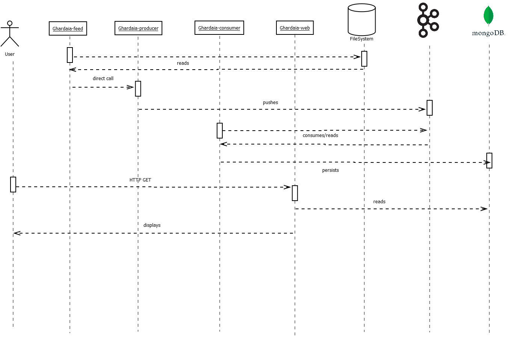

* Originally based on https://thepracticaldeveloper.com/spring-boot-kafka-config/ 


* Default profile launches the server and the message producer microservice.
* Profile `consumer` launches a consumer microservice. Several can be executed in parallel.
* Server, producer and consumer should be split in different Maven artefacts, but for the moment we don't mind.

# Target Macro-architecture

cf 

# Java
Set Java 17 in `PATH`:

```
set JAVA_HOME=C:\win32app\jdk-17.0.1
set PATH=%JAVA_HOME%\bin;%PATH%
```

# Kafka
* Start ZooKeeper
```
cd C:\win32app\kafka_2.13-2.8.1
bin\windows\zookeeper-server-start.bat config\zookeeper.properties
```
* Start Kafka server
```
cd C:\win32app\kafka_2.13-2.8.1
.\bin\windows\kafka-server-start.bat .\config\server.properties
```
* Start Kafka consumer (not needed)
```
cd C:\win32app\kafka_2.13-2.8.1
.\bin\windowskafka-console-consumer.bat --bootstrap-server localhost:9092 --topic advice-topic --from-beginning
```
* Purge a topic
```
cd C:\win32app\kafka_2.13-2.8.1\bin\windows
kafka-topics.bat  --bootstrap-server localhost:9092 --delete --topic advice-topic
```

# MongoDB

* Install MongoDB and navigate to install folder:
```
cd C:\win32app\mongodb-win32-x86_64-windows-4.4.4
mkdir data/db
```
* Start MongoDB (without access control)
```
.\bin\mongod  --port 27017 --dbpath ./data/db
```
* Connect to the instance and create the admin
```
.\bin\mongo --port 27017

```
* Create the user administrator.
```
    use admin
    db.createUser(
      {
        user: "ghardaia",
        pwd: "ghardaia",
        roles: [ { role: "userAdminAnyDatabase", db: "admin" } ]
      }
    )
```
* Stop Mongo server, then restart it with access control:
```
.\bin\mongod --auth --port 27017 --dbpath ./data/db
```
* Authenticate as the user administrator.
```
.\bin\mongo --port 27017 -u "ghardaia" -p "ghardaia"  --authenticationDatabase "admin"
```

## Basic operations

```
// Select the right DB
use myFirstDatabase
select  * from letter
// count elements in collection
db.getCollection("letter").countDocuments()
db.letter.countDocuments();
// truncate the table
db.letter.deleteMany({})
```
